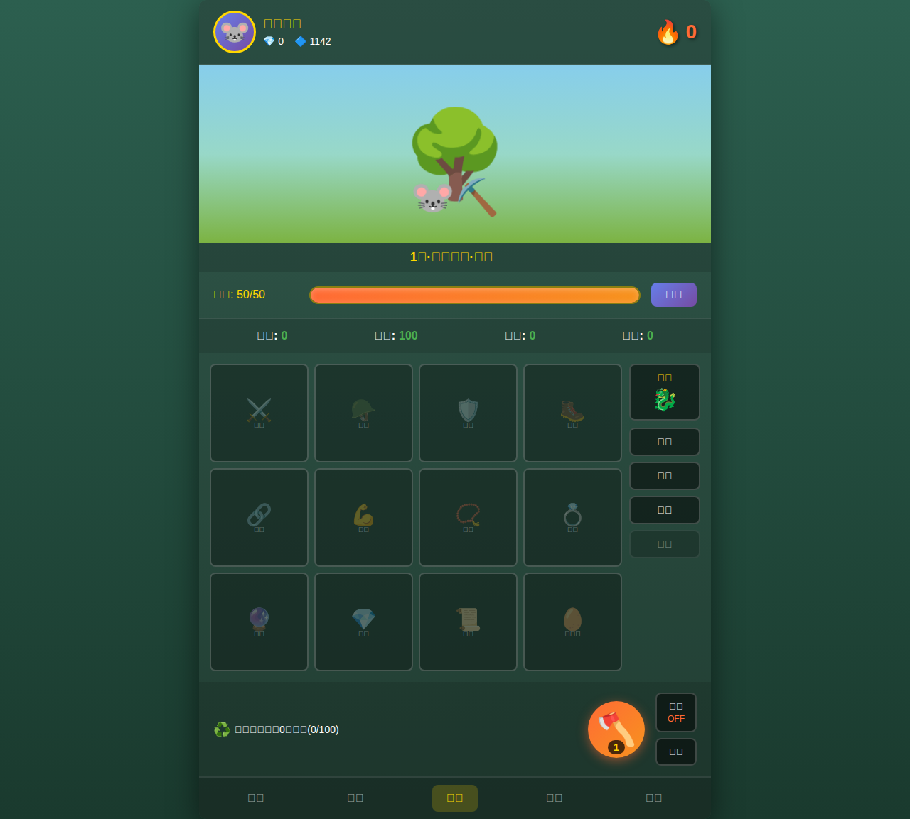
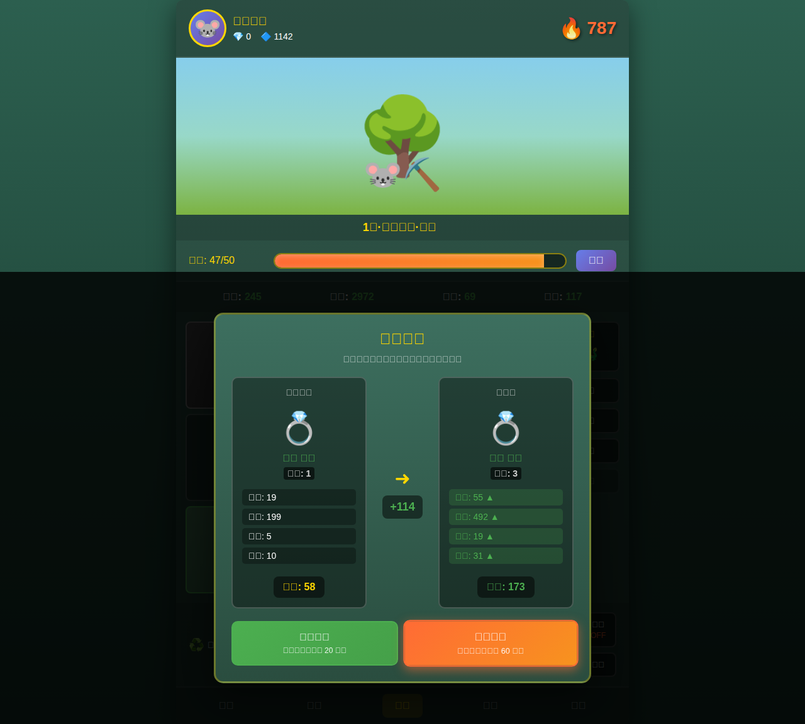
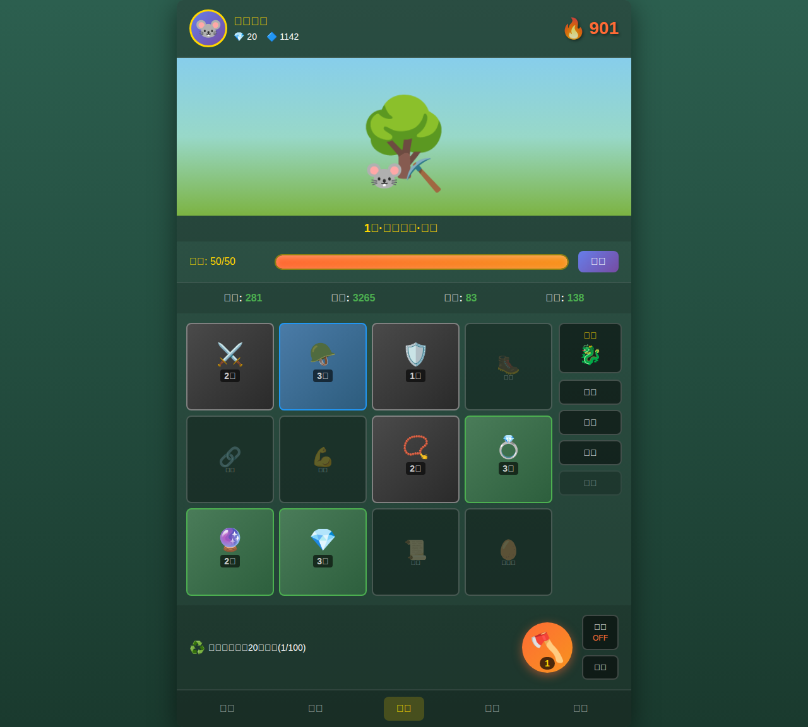

# 寻道修仙 - 修仙放置游戏

一个简单有趣的修仙题材放置类小游戏。通过砍树获取装备，提升战力，体验修仙之路！

## ✨ 游戏亮点

- 🎮 **简单易上手**：点击砍树即可开始游戏，无复杂操作
- ⚔️ **装备收集**：12种装备类型，8种品质等级（普通→至尊），随机掉落充满惊喜
- 🆙 **等级系统**：通过砍树升级，解锁更强装备，体验11个修仙境界（炼气前期→飞升期）
- 💪 **战力成长**：等级和战力相互促进，战力越高掉落越好
- ✨ **词条系统**：史诗及以上品质装备拥有特殊词条，进一步提升属性
- 🎯 **技能系统**：30级以上史诗装备可拥有技能，包括触发技能和抗性技能
- 📊 **智能对比**：获得同类装备时自动弹出对比界面，属性差异一目了然  
- 🔄 **自动化**：支持自动装备模式（10级筑基期解锁），解放双手
- 💾 **进度保存**：使用LocalStorage自动保存游戏进度
- 🎨 **精美界面**：修仙风格UI设计，emoji装备图标生动有趣，掉落时有品质光柱特效

## 🚀 快速开始

### 在线游玩

访问 GitHub Pages 立即开始游戏：[https://gladmo.github.io/searchdao/](https://gladmo.github.io/searchdao/)

### 本地运行

**推荐方式：使用开发服务器**
```bash
# 1. 安装依赖
npm install

# 2. 启动开发服务器（支持热更新）
npm run dev

# 3. 在浏览器中访问
# 服务器会自动打开浏览器，或手动访问显示的本地地址（通常是 http://localhost:5173）
```

**生产构建**
```bash
# 构建生产版本
npm run build

# 预览生产构建
npm run preview
```

## 🎮 游戏特性

### 核心系统

- **砍树系统**：点击砍树按钮或直接点击树木进行砍伐
  - 每次砍树消耗1点修为（体力）
  - 每次砍树随机获得一件装备
  
- **等级系统**：通过砍树积累修为提升等级
  - 每砍一次树获得10点修为
  - 升级所需修为 = 当前等级 × 100
  - 等级提升后装备属性倍率增加10%
  - 共11个修仙境界：炼气前期（1-3级）、炼气后期（4-9级）、筑基期（10-19级）、金丹期（20-29级）、元婴期（30-39级）、化神期（40-49级）、炼虚期（50-59级）、合体期（60-69级）、大乘期（70-89级）、渡劫期（90-99级）、飞升期（100级+）
  - 每个境界分为多个阶位（如一阶、二阶等）
  - 升级时显示✨动画效果
  
- **装备系统**：12种装备类型，每种装备独立占据一个槽位
  - ⚔️ 武器、🪖 头盔、🛡️ 护甲、🥾 靴子
  - 🔗 腰带、💪 护腕、📿 项链、💍 戒指
  - 🔮 玉佩、💎 宝石、📜 符咒、🥚 灵兽蛋
  
- **品质系统**：8种装备品质，影响属性数值和掉落率
  - 普通 (基础掉落率 50%, 属性倍率 1.0x)
  - 精良 (基础掉落率 30%, 属性倍率 1.06x)  
  - 稀有 (基础掉落率 15%, 属性倍率 1.13x)
  - 史诗 (基础掉落率 5%, 属性倍率 1.20x)
  - 传说 (基础掉落率 0%, 属性倍率 1.28x)
  - 神话 (基础掉落率 0%, 属性倍率 1.36x)
  - 不朽 (基础掉落率 0%, 属性倍率 1.45x)
  - 至尊 (基础掉落率 0%, 属性倍率 1.55x)
  - **战力加成**：战力越高，稀有装备掉落率越高（传说及以上品质需要高战力才能掉落）
  
- **属性系统**：每件装备包含四维属性
  - 攻击、生命、防御、敏捷
  - 装备等级越高，属性越强
  - **等级加成**：角色等级越高，装备属性倍率越高
  - **战力加成**：战力越高，装备属性数值越好（最高+50%）
  - **属性波动**：等级提升增加属性随机波动范围（±40% → ±80%）
  
- **词条系统**：史诗及以上品质装备可拥有特殊词条
  - 词条类型：攻击类（力道、锋利、破甲、暴击）、生命类（生机、回春、护体）、防御类（坚固、守护、铁壁）、敏捷类（迅捷、轻灵、闪避）、特殊类（五行、灵力、神通）
  - 词条数量随装备等级提升：史诗品质且20级以下无词条，21-40级1个，41-60级2个，61-80级3个，81-90级4个，91级以上5个
  - 词条给予额外属性加成，提升战力
  
- **技能系统**：史诗及以上品质的高等级装备可拥有技能
  - **触发技能**（6种）：击晕、暴击、连击、闪避、反击、吸血
  - **抗性技能**（6种）：击晕抗性、暴击抗性、连击抗性、闪避抗性、反击抗性、吸血抗性
  - 技能数量随装备等级提升：史诗品质且30级以下无技能，30-49级1个，50-69级2个，70-89级3个，90级以上4个
  - 技能值会随装备等级缩放，高等级装备的技能效果更强
  - 技能也会增加战力计算
  
- **战力计算**：综合评估角色实力
  - 战力 = 攻击 + 生命/10 + 防御×2 + 敏捷
  - 战力影响装备掉落品质和属性强度
  
- **修为系统**（体力值）：资源管理机制
  - 每次砍树消耗1点修为
  - 每秒自动恢复1点修为
  - 最大修为值 = 50 + 等级 × 5（等级越高，修为上限越高）
  
- **装备对比**：智能装备替换系统
  - 获得相同类型装备时自动弹出对比窗口
  - 显示新旧装备属性差异（红色▼表示降低，绿色▲表示提升）
  - 可选择装备新装备或保留旧装备
  - 未装备的装备会自动分解获得灵石
  
- **自动装备**：可开启自动模式（10级筑基期解锁）
  - 自动替换低战力的装备
  - 自动分解不需要的装备
  - 解放双手，实现真正的放置游戏体验
  
- **分解系统**：资源回收机制
  - 点击已装备的装备可手动分解
  - 分解装备获得灵石（游戏货币）
  - 分解次数和收益在游戏记录中显示

## 🛠️ 技术栈

- **前端框架**：React 18 + Vite
- **状态管理**：React Context API
- **构建工具**：Vite 7.x
- **数据存储**：LocalStorage 本地存储游戏进度
- **部署方式**：GitHub Actions 自动部署到 GitHub Pages

## 📁 项目结构

```
searchdao/
├── src/                    # React应用源码
│   ├── components/         # React组件（13个）
│   │   ├── TopBar.jsx                    # 顶部栏（玩家信息、战力）
│   │   ├── Notification.jsx              # 通知组件
│   │   ├── GameArea.jsx                  # 游戏区域（砍树）
│   │   ├── DropAnimation.jsx             # 装备掉落动画（品质光柱）
│   │   ├── LevelDisplay.jsx              # 等级显示
│   │   ├── StaminaBar.jsx                # 修为条
│   │   ├── StatsDisplay.jsx              # 属性显示
│   │   ├── EquipmentGrid.jsx             # 装备网格
│   │   ├── BottomActions.jsx             # 底部操作
│   │   ├── BottomNav.jsx                 # 底部导航
│   │   ├── EquipmentComparisonModal.jsx  # 装备对比弹窗
│   │   ├── EquipmentDetailModal.jsx      # 装备详情弹窗（显示词条和技能）
│   │   └── RecordsModal.jsx              # 记录查询弹窗
│   ├── contexts/           # React Context
│   │   └── GameContext.jsx       # 游戏状态管理
│   ├── utils/              # 工具模块
│   │   ├── constants.js          # 游戏常量配置
│   │   ├── equipment.js          # 装备生成、词条、技能
│   │   ├── calculations.js       # 战力计算
│   │   └── storage.js            # 本地存储
│   ├── App.jsx             # 主应用组件
│   ├── App.css             # 主应用样式
│   ├── main.jsx            # 应用入口
│   └── index.css           # 全局样式
├── screenshots/            # 游戏截图
├── index.html              # HTML模板
├── vite.config.js          # Vite配置
├── package.json            # 依赖管理
├── eslint.config.js        # ESLint配置
├── ARCHITECTURE.md         # 架构文档
├── .gitignore              # Git忽略配置
└── .github/workflows/      # GitHub Actions配置
    └── deploy.yml          # 自动部署配置
```

## 📦 部署说明

项目配置了 GitHub Actions 自动部署流程：

- 当代码推送到 `master` 分支时自动触发部署
- 自动构建 React 应用并部署到 GitHub Pages
- 部署配置文件：`.github/workflows/deploy.yml`
- 部署目标：GitHub Pages

## 🔧 开发说明

### 本地开发

```bash
# 安装依赖
npm install

# 启动开发服务器
npm run dev

# 构建生产版本
npm run build
```

### 代码结构

项目采用模块化设计：

- **组件化**：UI拆分为13个独立的React组件，每个组件负责特定功能
- **状态管理**：使用Context API统一管理游戏状态，避免prop drilling
- **工具模块**：将游戏逻辑拆分为独立的工具模块（装备生成、词条/技能系统、战力计算、本地存储等）
- **样式隔离**：每个组件都有独立的CSS文件，便于维护
- **构建工具**：使用Vite作为构建工具，支持快速热更新和优化的生产构建

## 🤝 贡献

欢迎提交 Issue 和 Pull Request！

## 🎯 游戏玩法

### 快速开始

1. **开始砍树**
   - 点击中间的树木图标 🌳 或底部的砍树按钮 🪓
   - 每次砍树消耗1点修为（体力），获得10点修为积累（经验），并获得1件随机装备
   - 装备掉落时会显示品质光柱特效（品质越高，光柱越亮）

2. **管理装备**
   - 新获得的装备会自动装备到对应槽位
   - 如果槽位已有装备，会弹出对比窗口让你选择
   - 查看属性变化（绿色▲代表提升，红色▼代表降低）
   - 选择"装备新的"或"保留旧的"
   - 点击装备可查看详情（包括词条和技能）

3. **分解装备**
   - 点击已装备的装备图标可以分解
   - 分解获得灵石（货币）
   - 灵石数量显示在左上角 💎

4. **提升等级和战力**
   - 持续砍树积累修为升级（每级需要 等级×100 修为）
   - 等级提升后装备掉落属性更强
   - 战力越高，装备品质和属性越好
   - 战力显示在右上角 🔥
   - 合理搭配装备以获得最大战力
   - 史诗品质装备拥有词条和技能加成

5. **自动模式**（10级解锁）
   - 点击底部"自动"按钮开启自动装备模式
   - 系统会自动选择战力更高的装备
   - 自动分解低战力装备

### 游戏技巧

- 📈 **优先高品质**：至尊 > 不朽 > 神话 > 传说 > 史诗 > 稀有 > 精良 > 普通
- 🎯 **平衡发展**：尽量让所有槽位都装备上装备
- 💡 **战力优先**：对比时优先选择战力提升更多的装备
- ⚡ **合理使用修为**：修为会自动恢复，保持持续砍树即可
- 🔄 **等级与战力循环**：等级提升→装备更强→战力更高→掉落更好→战力再提升
- 🎲 **高战力高回报**：战力达到1000、5000、10000、20000、50000等门槛时，稀有装备掉落率显著提升
- ✨ **追求词条和技能**：史诗及以上品质的高等级装备拥有词条和技能，大幅提升战力
- 🎁 **等级优势**：装备等级越高属性越强，30级以上的史诗装备开始拥有技能

## 📸 游戏截图

### 游戏主界面
游戏主界面，包含12个装备槽位、修为条、角色属性和战力显示。点击树木或砍树按钮即可开始游戏。



### 装备对比功能
当获得相同类型装备时，会弹出对比窗口，显示新旧装备的属性差异，方便选择保留或替换。属性变化用绿色▲和红色▼标识。



### 多装备展示
装备多种装备后的游戏界面，展示不同品质和等级的装备。战力会随着装备的提升而增长。高品质装备拥有词条和技能加成。



## 📝 许可证

MIT
